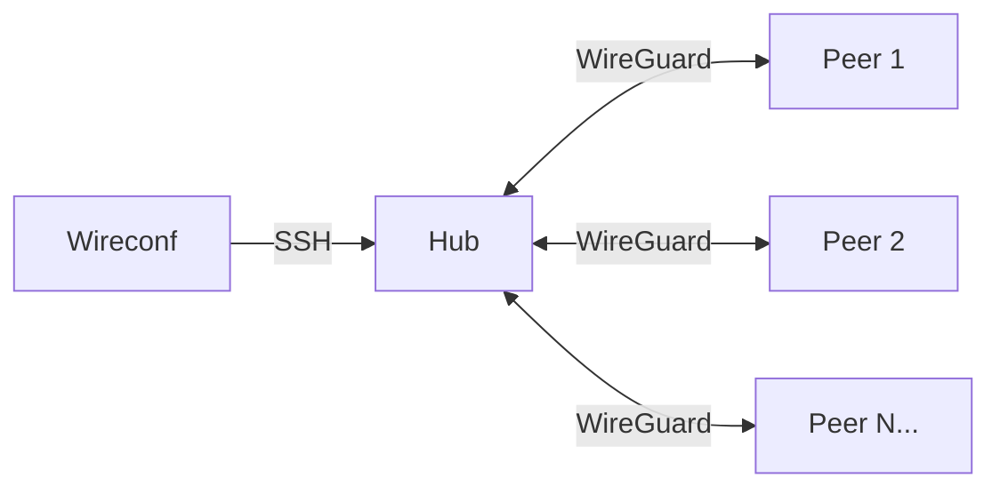

<div align="center">
  
</div>

# Wireconf

Bash-only WireGuard **hub-and-spoke** bootstrap for Debian/Ubuntu. 
Like Tailscale, but powered solely by optimism, duct tape, and bash scripts.

First host in an inventory becomes the hub; the rest become peers. Remote hosts are configured over SSH.



## Install

Pick one:

```bash
curl -fsSL https://raw.githubusercontent.com/wagga40/Wireconf/main/scripts/install.sh | bash
```

Downloads the latest single-file release, verifies its SHA-256, and installs it to `/usr/local/bin/wireconf` (override with `WIRECONF_PREFIX=$HOME/.local bash`).

```bash
git clone https://github.com/wagga40/Wireconf.git && cd Wireconf
task install PREFIX=/usr/local   # copies lib/ and examples/ next to the binary
```

Dev installs use [go-task](https://taskfile.dev) — install once with `brew install go-task` (macOS) or `sudo snap install task --classic` / the upstream installer on Linux. Run `task --list` to see every target.

```bash
git clone https://github.com/wagga40/Wireconf.git && cd Wireconf
./wireconf -V                    # run straight from the checkout
```

## Quick start

```bash
wireconf init                  # 1. Scaffold inventory + wireconf.env in the current directory
```

Edit the `inventory` file — place the hub on line 1, and list peers below:

```text
root@hub.example.com no
ubuntu@peer1.example.com 2222 no
root@peer2.example.com yes
```

**(Optional)**  Edit `wireconf.env` — set `WG_HUB_ENDPOINT` to the hub's public IP or DNS name if it differs from the host portion of the first line in `inventory`:

```bash
WG_HUB_ENDPOINT=203.0.113.10
```

Then deploy:

```bash
wireconf plan                  # 2. Check SSH, OS, tools, and show IP layout
wireconf apply                 # 3. Generate keys, upload configs, bring up tunnels
wireconf verify                #    Confirm handshakes and hub→peer pings
```

For a one-shot run use `wireconf up`, which chains `plan + apply + verify` and accepts hosts inline (no inventory file needed):

```bash
wireconf up                                    # uses ./inventory if present
wireconf up root@hub.example.com root@peer1    # no inventory file; stateless run
```

The `wireconf.env` file in the current directory is loaded automatically. To use a different file, run: `wireconf -e /path/to/wireconf.env plan`. Use `-y` to skip all interactive prompts (for CI/scripts).

Replace `wireconf` with `./wireconf` in every example if you are running from a checkout rather than an installed binary.

## Preparing hosts

On brand-new servers you usually need three things before `apply` can work: key-based SSH, passwordless `sudo`, and WireGuard userspace tools. Wireconf has two commands for this:

```bash
wireconf doctor                # auto-detects ./inventory (or pass inline hosts)
wireconf doctor root@hub.example.com root@peer1     # one-off diagnostic
```

`doctor` runs every preflight check non-fatally and prints an exact fix command for each failure (DNS, TCP, SSH host key, key auth, passwordless sudo, Debian/Ubuntu OS, required tools, and the kernel WireGuard module).

```bash
wireconf bootstrap                                  # uses ./inventory if present
wireconf bootstrap root@hub.example.com root@peer1  # inline hosts
```

`bootstrap` is idempotent and performs three steps per host, skipping each one when it is already satisfied:

1. `ssh-copy-id` (prompts once on `/dev/tty` for the target password if needed).
2. `/etc/sudoers.d/wireconf-<user>` NOPASSWD drop-in, validated with `visudo -cf`. Skipped when the SSH user is `root` or `sudo -n` already works.
3. `apt-get install -y wireguard` (Debian-family). Skipped when `wg`/`wg-quick` are already installed.

Typical first-time flow:

```bash
wireconf bootstrap root@hub.example.com root@peer1 root@peer2
wireconf doctor root@hub.example.com root@peer1 root@peer2
wireconf up root@hub.example.com root@peer1 root@peer2
```

## Commands

Listed in typical lifecycle order. Run `./wireconf -h` for the full flag list.

| Command | What it does |
|---------|-------------|
| `init` | Copy example files into the current directory (never overwrites existing files). |
| `bootstrap [HOST...]` | Idempotent `ssh-copy-id` + `/etc/sudoers.d/` NOPASSWD drop-in + `apt install wireguard`. Sequential (may prompt for passwords). |
| `doctor [HOST...]` | Non-fatal preflight report (DNS, TCP, SSH, sudo, OS, tools, wg module) with exact fix commands per host. |
| `plan` | Validate SSH, OS, tools on every host; show VPN IP layout and preflight status. |
| `up [HOST...]` | One-shot: `plan` + `apply` + `verify`. Inline `HOST` args skip the inventory file (stateless). |
| `show` | Generate configs and print to stdout without deploying. Add `--redact` to hide private keys. |
| `apply` | Run all `plan` checks, then deploy configs and bring up tunnels. Prompts on a TTY; `-y` skips. |
| `verify` / `test` | Check handshakes, hub→peer pings, print ASCII topology. Exits on first failure. |
| `status` | Non-fatal health check: interface state, handshake freshness, pings. Reports all issues. |
| `add-peer HOST [PORT] [TUNNEL]` | Append a peer line to the inventory (same as editing the file by hand). |
| `remove-peer HOST` | Remove a peer line from the inventory. Cannot remove the hub. |
| `teardown` | Stop and disable WireGuard on all inventory hosts. `-f` also removes config files. |
| `clean` | Delete local `inventory`, `*.wireconf.*` sidecars, and `wireconf.env`. Prompts first; `-y` skips. |

After adding or removing peers, run `plan` then `apply` to push the change.

## Inventory format

One host per line. `#` comments and blank lines are ignored. Duplicate hosts are rejected.

```text
HOST [SSH_PORT] [FULL_TUNNEL]
```

- **HOST** — `user@host` or bare hostname (SSH target). Use `localhost` or `127.0.0.1` for a local hub.
- **SSH_PORT** — optional; numeric second field overrides the default (`SSH_PORT` / `-S`, default 22).
- **FULL_TUNNEL** — `yes` or `no`; defaults to `FULL_TUNNEL_DEFAULT`.

VPN addresses follow line order: hub gets `.1`, first peer `.2`, and so on. Reordering lines changes IP assignments. Each `apply` regenerates all WireGuard keys.

## Configuration

Core settings live in `wireconf.env` (auto-loaded) or as CLI flags. See `./wireconf -h` for short flags.

| Setting | Default | Purpose |
|---------|---------|---------|
| `INVENTORY` / `--inventory` / `-I` | `inventory` | Path to the host list |
| `WG_INTERFACE` / `--iface` / `-n` | `wg0` | Interface and systemd unit name (1–15 chars) |
| `WG_NETWORK` / `--network` / `-c` | `10.200.0.0/24` | VPN IPv4 CIDR (`/16`–`/30`, must fit all usable host addresses) |
| `WG_PORT` / `--port` / `-p` | `51820` | Hub UDP listen port |
| `WG_HUB_ENDPOINT` / `-H` | *(hub host, SSH user stripped)* | Public address peers use for `Endpoint=` |
| `AUTO_START` / `--auto-start` / `-a` | `yes` | Enable `wg-quick@` on boot |
| `FULL_TUNNEL_DEFAULT` / `-t` | `no` | Default full-tunnel mode for inventory lines |
| `WG_KEEPALIVE` / `--keepalive` / `-k` | `25` | PersistentKeepalive seconds (0 = off) |
| `SSH_PORT` / `--ssh-port` / `-S` | `22` | Default SSH port when not set per line |

<details>
<summary>More settings</summary>

| Setting | Default | Purpose |
|---------|---------|---------|
| `WG_HUB_EGRESS` | *(auto)* | Hub egress interface for NAT; detected from default route if unset |
| `WG_MTU` | *(none)* | MTU for all WireGuard interfaces |
| `WG_PEER_DNS` | *(none)* | `DNS=` pushed to full-tunnel peers |
| `WG_SPLIT_DNS` | *(none)* | `DNS=` pushed to split-tunnel peers |
| `WG_HANDSHAKE_TIMEOUT` | `300` | Stale-handshake threshold in seconds for `verify`/`status` |
| `SSH_ACCEPT_NEW` / `--ssh-accept-new` | `no` | Auto-add new SSH host keys (`StrictHostKeyChecking=accept-new`) |
| `SSH_OPTS` | *(none)* | Extra `ssh`/`scp` options (don't add `-p`; use `SSH_PORT`) |
| `--parallel` / `WG_PARALLEL` | `1` | Concurrent SSH operations during `apply` (1–64) |
| `--force` / `-f` | — | Overwrite existing WireGuard state; with `teardown`, also removes configs |
| `--backup-dir` / `-b` | — | Copy existing configs before replacing |
| `--redact` | — | With `show`, omit `PrivateKey` lines from stdout |
| `WIRECONF_YES` / `-y` | — | Skip all confirmation prompts |
| `--env-file` / `-e` | `./wireconf.env` | Explicit env-file path (overrides auto-load) |

</details>

## Requirements

**Operator machine** (where you run `./wireconf`): `bash`, `openssh-client`, `awk`. `wg` is optional — if missing locally, keys are generated on the hub over SSH.

**Every target host**: Debian/Ubuntu with `wireguard-tools`, `systemd`, `iproute2`, `ping`. Hub also needs `iptables` when any peer uses full-tunnel. Missing `wireguard-tools` on a target can be installed interactively during `plan`/`apply` (or automatically with `-y`).

**SSH access**: key-based authentication to all non-local hosts; `sudo -n` must work without a password.

## Safety and re-runs

- `apply` is **re-runnable**. Changed inventory lines trigger per-host prompts instead of a blanket "Proceed?". Use `-y` to skip prompts in scripts.
- Hosts **removed** from the inventory since the last `apply` are automatically torn down (same as `teardown`) before new configs are deployed.
- Every mutating command (`apply`, `teardown`, `add-peer`, `remove-peer`) appends to `INVENTORY.wireconf.log`, an action log used for change detection.
- Use `--backup-dir DIR` to save existing configs before replacing them.

## Security notes

- Treat `wireconf.env` and `inventory` like credentials — the env file is `source`d by bash. Keep both out of version control (see `init`'s `.gitignore`).
- Hub `PostUp`/`PostDown` run under a shell on the server; interface-name validation prevents command injection.
- `SSH_OPTS` is word-split into `ssh`/`scp` arguments; avoid putting secrets there.

## Limits

- IPv4 only for this version.
- Hub **PostUp** uses `iptables` MASQUERADE when any peer is full-tunnel; hosts without `iptables` need manual adjustment.
- Open the hub's **UDP** `WG_PORT` toward the Internet.

## License

Use and modify as you see fit for your infrastructure.
